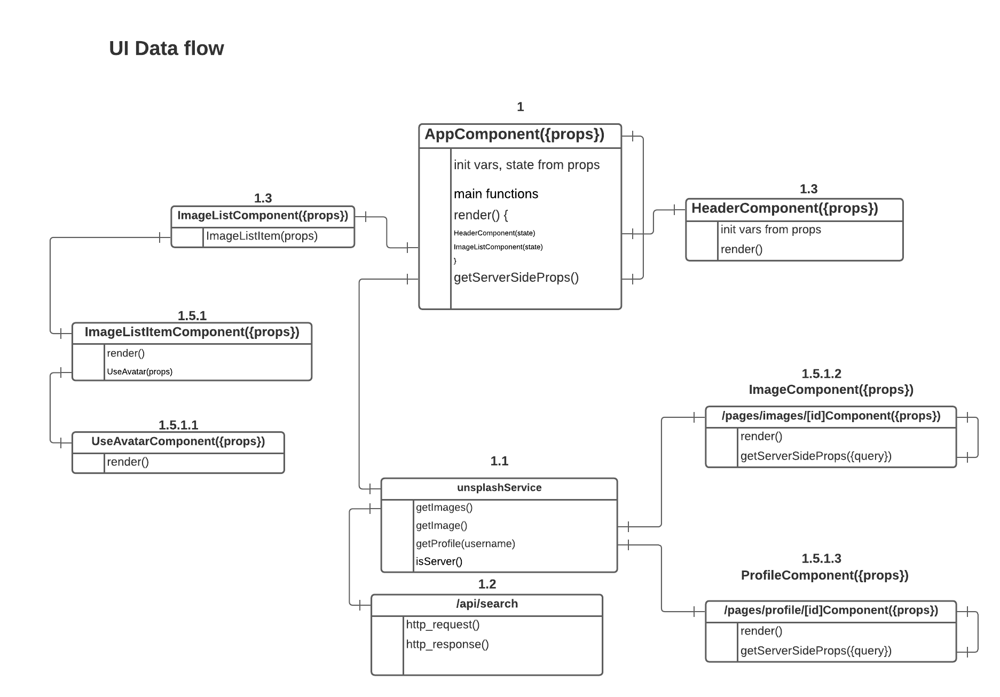

This is a starter template for [Learn Next.js](https://nextjs.org/learn).

Quick Links:

1. Preview deployment: http://imagepicker-git-main.mikebernal.vercel.app/
2. Action board: https://github.com/mikebernal/imagepicker/projects/1

## Screenshots

### UI data flow

### Index route

### Photo component

![Path "/photo/[id]"](./public/photo_component.png)

### Lessons learned

0. Always read and understand the documentations carefully.
1. (() => {}) - does not automatically return the statement(s) thus, needs to implicitly write return.
3. Create next.config.js and export image property domain when using external sources.
4. Directly fetch external API on components' getServerSideProps().
5. Do not name assets index other than your index.js in /pages/index. GitHub or Vercel gets confused when any assets are named index.
6. Use SSR if request involves sensitive credentials and tokens.
7. CSR has a delay of 1-2 seconds in rendering after the page loads.
8. console.log(typeof window) is a good way of checking if which side the statement runs.
9. getStaticProps and getServerSideProps runs everytime in development mode.
10. getStaticProps updates data on build.
11. getServerSideProps updates data on each request.
12. unstable_revalidate property solve getStaticProps problem in production by setting time interval of updating data from the backend.
13. getStaticPaths staticly generates pages at build time based on the paths property. It also gets all the url paths
14. To make image responsive on both width and height, use Image component inside a div's set dimension. The div must be position relative or absolute otherwise it will go to the nearest container.
15. Next/Image component doesn't do cropping
16. localStorage doesn't work in all browsers
